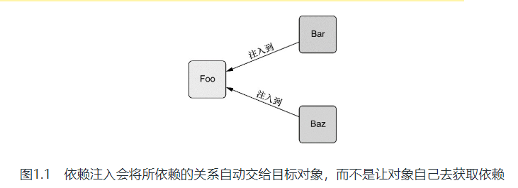
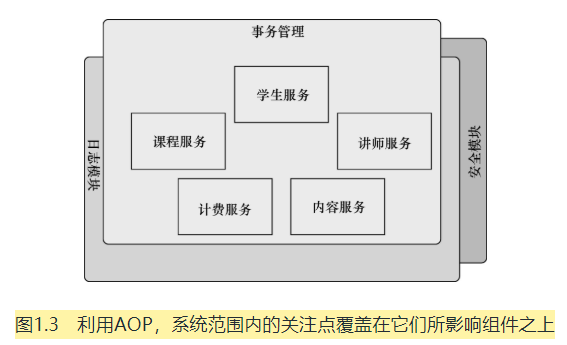
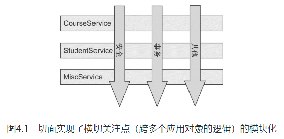
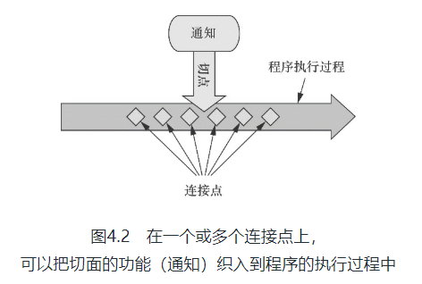
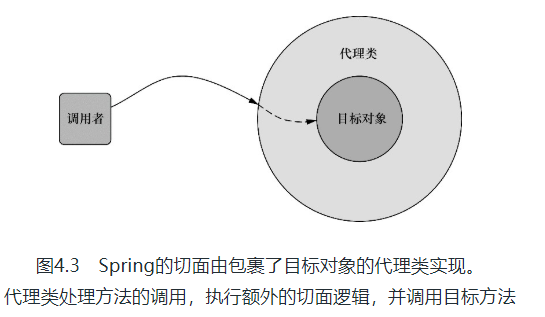
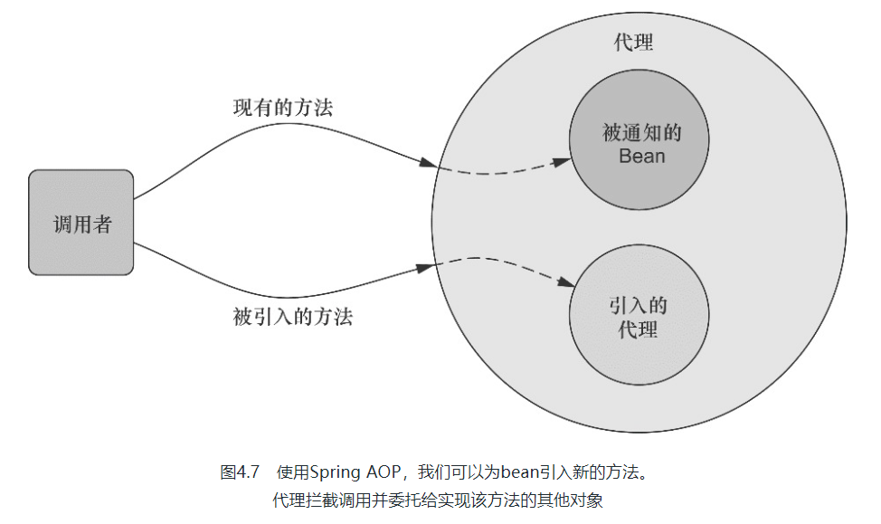
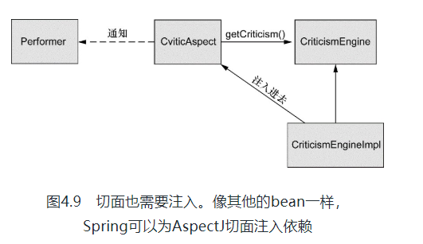
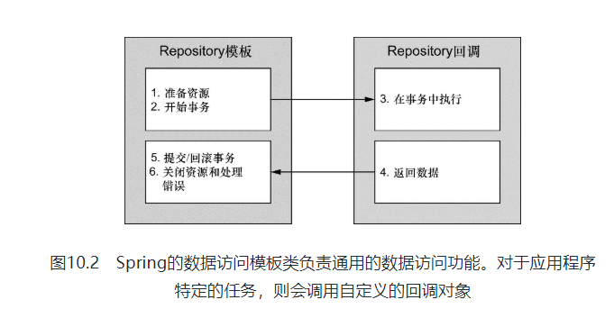
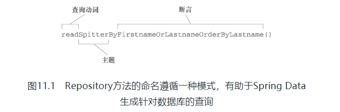
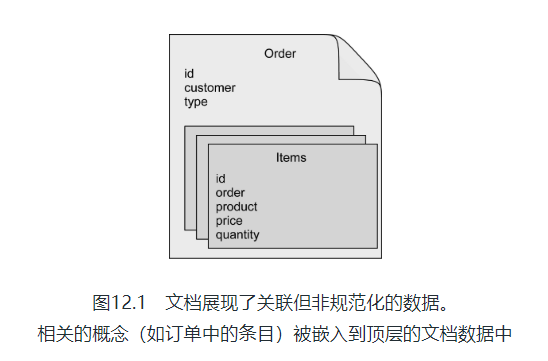

# 《Spring 实战 》Version 4

## chp1

### 依赖注入
通过DI，对象的依赖关系将由系统中负责协调各对象的第三方组件在创建对象的时候进行设定。对象无需自行创建或管理它们的依赖关系，如图1.1所示，依赖关系将被自动注入到需要它们的对象当中去。



### 应用切面
如图1.3所示，我们可以把切面想象为覆盖在很多组件之上的一个外壳。应用是由那些实现各自业务功能的模块组成的。借助AOP，可以使用各种功能层去包裹核心业务层。这些层以声明的方式灵活地应用到系统中，你的核心应用甚至根本不知道它们的存在。这是一个非常强大的理念，可以将安全、事务和日志关注点与核心业务逻辑相分离。



简单的BraveKnight类开始变得复杂，如果你还需要应对没有吟游诗人时的场景，那代码会变得更复杂。但利用AOP，你可以声明吟游诗人必须歌颂骑士的探险事迹，而骑士本身并不用直接访问Minstrel的方法。

### 使用模板
Spring旨在通过模板封装来消除样板式代码。Spring的JdbcTemplate使得执行数据库操作时，避免传统的JDBC样板代码成为了可能。

### 容器
理解容器将有助于理解对象是如何被管理的。

Spring容器并不是只有一个。Spring自带了多个容器实现，可以归为两种不同的类型。bean工厂（由org.springframework. beans. factory.eanFactory接口定义）是最简单的容器，提供基本的DI支持。应用上下文（由org.springframework.context.ApplicationContext接口定义）基于BeanFactory构建，并提供应用框架级别的服务，例如从属性文件解析文本信息以及发布应用事件给感兴趣的事件监听者。

* bean工厂
* context(preferred)

## chp2 装配bean
在Spring中，对象无需自己查找或创建与其所关联的其他对象。相反，容器负责把需要相互协作的对象引用赋予各个对象。例如，一个订单管理组件需要信用卡认证组件，但它不需要自己创建信用卡认证组件。订单管理组件只需要表明自己两手空空，容器就会主动赋予它一个信用卡认证组件。

创建应用对象之间协作关系的行为通常称为装配（wiring），这也是依赖注入（DI）的本质。

* Spring配置的可选方案:
    * 在XML中进行显式配置
    * 在Java中进行显式配置
    * 隐式的bean发现机制和自动装配
      1. 为了指定不同的基础包，你所需要做的就是在@ComponentScan的value属性中指明包的名称
      2. 如果在你的代码中没有进行null检查的话，这个处于未装配状态的属性有可能会出现NullPointerException。
    

具体的内容书中讲得十分详细

另；Java配置与xml混用，即mixedconfig包下的代码，按照书中内容构建有些问题。

## chp3 高级装配

### 环境与Profile

尽管每个DataSource bean都被声明在一个profile中，并且只有当规定的profile激活时，相应的bean才会被创建，但是可能会有其他的bean并没有声明在一个给定的profile范围内。没有指定profile的bean始终都会被创建，与激活哪个profile没有关系。

Spring提供了@ActiveProfiles注解，我们可以使用它来指定运行测试时要激活哪个profile。在集成测试时，通常想要激活的是开发环境的profile。

在条件化创建bean方面，Spring的profile机制是一种很棒的方法，这里的条件要基于哪个profile处于激活状态来判断。Spring 4.0中提供了一种更为通用的机制来实现条件化的bean定义，在这种机制之中，条件完全由你来确定。

### 条件化的bean

假设你希望一个或多个bean只有在应用的类路径下包含特定的库时才创建。或者我们希望某个bean只有当另外某个特定的bean也声明了之后才会创建。我们还可能要求只有某个特定的环境变量设置之后，才会创建某个bean。

设置给@Conditional的类可以是任意实现了Condition接口的类型。可以看出来，这个接口实现起来很简单直接，只需提供matches()方法的实现即可。如果matches()方法返回true，那么就会创建带有@Conditional注解的bean。如果matches()方法返回false，将不会创建这些bean。

### 处理自动装配的歧义性

* 标示首选的bean
* 限定自动装配的bean

### bean的作用域

在默认情况下，Spring应用上下文中所有bean都是作为以单例（singleton）的形式创建的。也就是说，不管给定的一个bean被注入到其他bean多少次，每次所注入的都是同一个实例。

Spring定义了多种作用域，可以基于这些作用域创建bean，包括：

* 单例（Singleton）：在整个应用中，只创建bean的一个实例。
* 原型（Prototype）：每次注入或者通过Spring应用上下文获取的时候，都会创建一个新的bean实例。
* 会话（Session）：在Web应用中，为每个会话创建一个bean实例。
* 请求（Rquest）：在Web应用中，为每个请求创建一个bean实例。

在Web应用中，如果能够实例化在会话和请求范围内共享的bean，那将是非常有价值的事情。例如，在典型的电子商务应用中，可能会有一个bean代表用户的购物车。如果购物车是单例的话，那么将会导致所有的用户都会向同一个购物车中添加商品。另一方面，如果购物车是原型作用域的，那么在应用中某一个地方往购物车中添加商品，在应用的另外一个地方可能就不可用了，因为在这里注入的是另外一个原型作用域的购物车。

### 运行时注入

有时候硬编码是可以的，但有的时候，我们可能会希望避免硬编码值，而是想让这些值在运行时再确定。为了实现这些功能，Spring提供了两种在运行时求值的方式：

* 属性占位符（Property placeholder）。
* Spring表达式语言（SpEL）。

## chp4 Spring AOP

在软件开发中，散布于应用中多处的功能被称为横切关注点（cross-cutting concern）。通常来讲，这些横切关注点从概念上是与应用的业务逻辑相分离的（但是往往会直接嵌入到应用的业务逻辑之中）。把这些横切关注点与业务逻辑相分离正是面向切面编程（AOP）所要解决的问题。

如前所述，切面能帮助我们模块化横切关注点。简而言之，横切关注点可以被描述为影响应用多处的功能。例如，安全就是一个横切关注点，应用中的许多方法都会涉及到安全规则。图4.1直观呈现了横切关注点的概念。



在使用面向切面编程时，我们仍然在一个地方定义通用功能，但是可以通过声明的方式定义这个功能要以何种方式在何处应用，而无需修改受影响的类。横切关注点可以被模块化为特殊的类，这些类被称为切面（aspect）。这样做有两个好处：首先，现在每个关注点都集中于一个地方，而不是分散到多处代码中；其次，服务模块更简洁，因为它们只包含主要关注点（或核心功能）的代码，而次要关注点的代码被转移到切面中了。

### 定义AOP术语

描述切面的常用术语有通知（advice）、切点（pointcut）和连接点（join point）。图4.2展示了这些概念是如何关联在一起的。



Spring提供了4种类型的AOP支持：

* 基于代理的经典Spring AOP；
* 纯POJO切面；
* @AspectJ注解驱动的切面；
* 注入式AspectJ切面（适用于Spring各版本）。

前三种都是Spring AOP实现的变体，Spring AOP构建在动态代理基础之上，因此，Spring对AOP的支持局限于方法拦截。

通过在代理类中包裹切面，Spring在运行期把切面织入到Spring管理的bean中。如图4.3所示，代理类封装了目标类，并拦截被通知方法的调用，再把调用转发给真正的目标bean。当代理拦截到方法调用时，在调用目标bean方法之前，会执行切面逻辑。



*Spring只支持方法级别的连接点*

### 通过切点来选择连接点

连接点：我们的应用可能也有数以千计的时机应用通知。这些时机被称为连接点。连接点是在应用执行过程中能够插入切面的一个点。这个点可以是调用方法时、抛出异常时、甚至修改一个字段时。切面代码可以利用这些点插入到应用的正常流程之中，并添加新的行为。

关于Spring AOP的AspectJ切点，最重要的一点就是Spring仅支持AspectJ切点指示器（pointcut designator）的一个子集。让我们回顾下，Spring是基于代理的，而某些切点表达式是与基于代理的AOP无关的。

相同的切点表达式我们重复了四遍，这可真不是什么光彩的事情。这样的重复让人感觉有些不对劲。如果我们只定义这个切点一次，然后每次需要的时候引用它，那么这会是一个很好的方案。

幸好，我们完全可以这样做：@Pointcut注解能够在一个@AspectJ切面内定义可重用的切点。接下来的程序清单4.2展现了新的Audience，现在它使用了@Pointcut。

### 使用注解创建切面

```java
@Aspect
@Component
public class Audience {

    // 定义切点
    @Pointcut("execution(* interfaces.Performance.perform(..))")
    public void performance() {}

    // 前置通知
    @Before("performance()")
    public void silenceCellPhone() {
        System.out.println("手机调静音");
    }

    // 前置通知
    @Before("performance()")
    public void takeSeats() {
        System.out.println("就坐");
    }

    // 后置返回通知
    @AfterReturning("performance()")
    public void applause() {
        System.out.println("鼓掌！！！");
    }

    // 后置异常通知
    @AfterThrowing("performance()")
    public void demandRefund() {
        System.out.println("要求退票退钱");
    }

}
```

我们需要记住的是，Spring的AspectJ自动代理仅仅使用@AspectJ作为创建切面的指导，切面依然是基于代理的。**在本质上，它依然是Spring基于代理的切面。这一点非常重要，因为这意味着尽管使用的是@AspectJ注解，但我们仍然限于代理方法的调用。**如果想利用AspectJ的所有能力，我们必须在运行时使用AspectJ并且不依赖Spring来创建基于代理的切面。

环绕通知是最为强大的通知类型。它能够让你所编写的逻辑将被通知的目标方法完全包装起来。实际上就像在一个通知方法中同时编写前置通知和后置通知。

### 通过注解引入新功能

实际上，利用被称为引入的AOP概念，切面可以为Spring bean添加新方法。

回顾一下，在Spring中，切面只是实现了它们所包装bean相同接口的代理。如果除了实现这些接口，代理也能暴露新接口的话，会怎么样呢？那样的话，切面所通知的bean看起来像是实现了新的接口，即便底层实现类并没有实现这些接口也无所谓。图4.7展示了它们是如何工作的。



### 注入AspectJ切面

但是精心设计且有意义的切面很可能依赖其他类来完成它们的工作。如果在执行通知时，切面依赖于一个或多个类，我们可以在切面内部实例化这些协作的对象。但更好的方式是，我们可以借助Spring的依赖注入把bean装配进AspectJ切面中。



简而言之，Spring不能像之前那样使用<bean>声明来创建一个CriticAspect实例——它已经在运行时由AspectJ创建完成了。Spring需要通过aspectOf()工厂方法获得切面的引用，然后像<bean>元素规定的那样在该对象上执行依赖注入。

## chp5 简单MVC
我们所编写的控制器将会带有@Controller注解，这会使其成为组件扫描时的候选bean。因此，我们不需要在配置类中显式声明任何的控制器。

在Spring MVC中，控制器只是方法上添加了@RequestMapping注解的类，这个注解声明了它们所要处理的请求。

你可以看到，home()方法其实并没有做太多的事情：它返回了一个String类型的“home”。这个String将会被Spring MVC解读为要渲染的视图名称。DispatcherServlet会要求视图解析器将这个逻辑名称解析为实际的视图。

### 定义类级别的请求处理
处理器方法上的@RequestMapping注解会对类级别上的@RequestMapping的声明进行补充。

*image*

现在，HomeController的home()方法能够映射到对“/”和“/homepage”的GET请求

Model实际上就是一个Map（也就是key-value对的集合），它会传递给视图，这样数据就能渲染到客户端了。

*code*
这个版本与其他的版本有些差别。它并没有返回视图名称，也没有显式地设定模型，这个方法返回的是Spittle列表。当处理器方法像这样返回对象或集合时，这个值会放到模型中，模型的key会根据其类型推断得出（在本例中，也就是spittleList）。

### 接受请求的输入
Spring MVC允许以多种方式将客户端中的数据传送到控制器的处理器方法中，包括：
* 查询参数（Query Parameter）
* 路径变量（Path Variable）
* 表单参数（Form Parameter）

这个处理器方法将会处理形如“/spittles/show?spittle_id=12345”这样的请求。尽管这也可以正常工作，但是从面向资源的角度来看这并不理想。在理想情况下，要识别的资源（Spittle）应该通过URL路径进行标示，而不是通过查询参数。对“/spittles/12345”发起GET请求要优于对“/spittles/show?spittle_id=12345”发起请求。前者能够识别出要查询的资源，而后者描述的是带有参数的一个操作——本质上是通过HTTP发起的RPC。

为了实现这种路径变量，Spring MVC允许我们在@RequestMapping路径中添加占位符。占位符的名称要用大括号（“{”和“}”）括起来。路径中的其他部分要与所处理的请求完全匹配，但是占位符部分可以是任意的值。

如果方法的参数名碰巧与占位符的名称相同，因此我们可以去掉@PathVariable中的value属性

## chp6 渲染web视图

对于大部分视图解析器来讲，每一项都对应Java Web应用中特定的某种视图技术。InternalResourceViewResolver一般会用于JSP，TilesViewResolver用于Apache Tiles视图，而FreeMarkerViewResolver和VelocityViewResolver分别对应FreeMarker和Velocity模板视图。

Spring提供了两个JSP标签库，用来帮助定义Spring MVC Web的视图。其中一个标签库会用来渲染HTML表单标签，这些标签可以绑定model中的某个属性。另外一个标签库包含了一些工具类标签，我们随时都可以非常便利地使用它们。

你可能会想知道“${}”和“*{}”括起来的表达式到底有什么区别。“${}”表达式（如${spitter}）是变量表达式（variable expression）。一般来讲，它们会是对象图导航语言（Object-Graph Navigation Language，OGNL）表达式（http://commons.apache.org/proper/commons-ognl/）。但在使用Spring的时候，它们是SpEL表达式。在${spitter}这个例子中，它会解析为key为spitter的model属性。

而对于“*{}”表达式，它们是选择表达式（selection expression）。变量表达式是基于整个SpEL上下文计算的，而选择表达式是基于某一个选中对象计算的。在本例的表单中，选中对象就是<form>标签中th:object属性所设置的对象：模型中的Spitter对象。因此，“*{firstName}”表达式就会计算为Spitter对象的firstName属性。

## chp7 Spring MVC 高级技术
pass

## chp8 Spring Web Flow

pass

## chp9 保护Web应用

pass   

## chp10 Spring JDBC

Spring将数据访问过程中固定的和可变的部分明确划分为两个不同的类：模板（template）和回调（callback）。模板管理过程中固定的部分，而回调处理自定义的数据访问代码。图10.2展现了这两个类的职责。



无论选择Spring的哪种数据访问方式，你都需要配置一个数据源的引用。Spring提供了在Spring上下文中配置数据源bean的多种方式，包括：

- 通过JDBC驱动程序定义的数据源

- 通过JNDI查找的数据源

- 连接池的数据源

- 嵌入式的数据源

  嵌入式数据库作为应用的一部分运行，而不是应用连接的独立数据库服务器。尽管在生产环境的设置中，它并没有太大的用处，但是对于开发和测试来讲，嵌入式数据库都是很好的可选方案。这是因为每次重启应用或运行测试的时候，都能够重新填充测试数据。

### JDBC模板

在这里，JdbcSpitterRepository类上使用了@Repository注解，这表明它将会在组件扫描的时候自动创建。它的构造器上使用了@Inject注解，因此在创建的时候，会自动获得一个JdbcOperations对象。JdbcOperations是一个接口，定义了JdbcTemplate所实现的操作。通过注入JdbcOperations，而不是具体的JdbcTemplate，能够保证JdbcSpitterRepository通过JdbcOperations接口达到与JdbcTemplate保持松耦合。

## chp11 使用对象-关系映射持久化数据

在数据持久化的世界中，JDBC就像自行车。对于份内的工作，它能很好地完成并且在一些特定的场景下表现出色。但随着应用程序变得越来越复杂，对持久化的需求也变得更复杂。我们需要将对象的属性映射到数据库的列上，并且需要自动生成语句和查询，这样我们就能从无休止的问号字符串中解脱出来。此外，我们还需要一些更复杂的特性：

* 延迟加载（Lazy loading）：随着我们的对象关系变得越来越复杂，有时候我们并不希望立即获取完整的对象间关系。举一个典型的例子，假设我们在查询一组PurchaseOrder对象，而每个对象中都包含一个LineItem对象集合。如果我们只关心PurchaseOrder的属性，那查询出LineItem的数据就毫无意义。而且这可能是开销很大的操作。延迟加载允许我们只在需要的时候获取数据。
* 预先抓取（Eager fetching）：这与延迟加载是相对的。借助于预先抓取，我们可以使用一个查询获取完整的关联对象。如果我们需要PurchaseOrder及其关联的LineItem对象，预先抓取的功能可以在一个操作中将它们全部从数据库中取出来，节省了多次查询的成本。
* 级联（Cascading）：有时，更改数据库中的表会同时修改其他表。回到我们订购单的例子中，当删除Order对象时，我们希望同时在数据库中删除关联的LineItem。

一些可用的框架提供了这样的服务，这些服务的通用名称是对象/关系映射（object-relational mapping，ORM）。在持久层使用ORM工具，可以节省数千行的代码和大量的开发时间。ORM工具能够把你的注意力从容易出错的SQL代码转向如何实现应用程序的真正需求。

### 在Spring中集成Hibernate

Hibernate是在开发者社区很流行的开源持久化框架。它不仅提供了基本的对象关系映射，还提供了ORM工具所应具有的所有复杂功能，比如缓存、延迟加载、预先抓取以及分布式缓存。

### Spring Persistence API (JPA)

简单来讲，基于JPA的应用程序需要使用EntityManagerFactory的实现类来获取EntityManager实例。JPA定义了两种类型的实体管理器：

* 应用程序管理类型（Application-managed）：当应用程序向实体管理器工厂直接请求实体管理器时，工厂会创建一个实体管理器。在这种模式下，程序要负责打开或关闭实体管理器并在事务中对其进行控制。这种方式的实体管理器适合于不运行在Java EE容器中的独立应用程序。

* 容器管理类型（Container-managed）：实体管理器由Java EE创建和管理。应用程序根本不与实体管理器工厂打交道。相反，实体管理器直接通过注入或JNDI来获取。容器负责配置实体管理器工厂。这种类型的实体管理器最适用于Java EE容器，在这种情况下会希望在persistence.xml指定的JPA配置之外保持一些自己对JPA的控制。

### Spring Data

实际上，我们并不需要实现findByUsername()。方法签名已经告诉Spring Data JPA足够的信息来创建这个方法的实现了。

当创建Repository实现的时候，Spring Data会检查Repository接口的所有方法，解析方法的名称，并基于被持久化的对象来试图推测方法的目的。本质上，Spring Data定义了一组小型的领域特定语言（domain-specific language ，DSL），在这里，持久化的细节都是通过Repository方法的签名来描述的。



当Spring Data JPA为Repository接口生成实现的时候，它还会查找名字与接口相同，并且添加了Impl后缀的一个类。如果这个类存在的话，Spring Data JPA将会把它的方法与Spring Data JPA所生成的方法合并在一起。对于SpitterRepository接口而言，要查找的类名为SpitterRepositoryImpl。

# chp12 使用NoSQL数据库

## MongoDB

MongoDB是最为流行的开源文档数据库之一。Spring Data MongoDB提供了三种方式在Spring应用中使用MongoDB：

* 通过注解实现对象-文档映射；
* 使用MongoTemplate实现基于模板的数据库访问；
* 自动化的运行时Repository生成功能。

 为了访问需要认证的MongoDB服务器，MongoClient在实例化的时候必须要有一个MongoCredential的列表。在程序清单12.3中，我们为此创建了一个MongoCredential。为了将凭证信息的细节放在配置类外边，它们是通过注入的Environment对象解析得到的。

@Document和@Id注解类似于JPA的@Entity和@Id注解。我们将会经常使用这两个注解，对于要以文档形式保存到MongoDB数据库的每个Java类型都会使用这两个注解

我们可以看到，Order类添加了@Document注解，这样它就能够借助MongoTemplate或自动生成的Repository进行持久化。其id属性上使用了@Id注解，用来指定它作为文档的ID。除此之外，customer属性上使用了@Field注解，这样的话，当文档持久化的时候customer属性将会映射为名为client的域

并且如果我们不使用@Field注解进行设置的话，那么文档域中的名字将会与对应的Java属性相同。



## Neo4j

文档型数据库会将数据存储到粗粒度的文档中，而图数据库会将数据存储到多个细粒度的节点中，这些节点之间通过关系建立关联。图数据库中的一个节点通常会对应数据库中的一个概念（concept），它会具备描述节点状态的属性。连接两个节点的关联关系可能也会带有属性。

## Redis

Redis是一种特殊类型的数据库，它被称之为key-value存储。顾名思义，key-value存储保存的是键值对。实际上，key-value存储与哈希Map有很大的相似性。可以不太夸张地说，它们就是持久化的哈希Map。

# chp13 启用对缓存的支持

Spring对缓存的支持有两种方式：

* 注解驱动的缓存
* XML声明的缓存

使用Spring的缓存抽象时，最为通用的方式就是在方法上添加`@Cacheable`和`@CacheEvict`注解。

## 填充缓存

我们可以看到，`@Cacheable`和`@CachePut`注解都可以填充缓存，但是它们的工作方式略有差异。

`@Cacheable`首先在缓存中查找条目，如果找到了匹配的条目，那么就不会对方法进行调用了。如果没有找到匹配的条目，方法会被调用并且返回值要放到缓存之中。而`@CachePut`并不会在缓存中检查匹配的值，目标方法总是会被调用，并将返回值添加到缓存之中。

与`@Cacheable`和`@CachePut`不同，`@CacheEvict`能够应用在返回值为void的方法上，而`@Cacheable`和`@CachePut`需要非void的返回值，它将会作为放在缓存中的条目。因为`@CacheEvict`只是将条目从缓存中移除，因此它可以放在任意的方法上，甚至void方法。

## 小结

在这个过程中，我们讨论了缓存实际上是一种面向切面的行为。Spring将缓存实现为一个切面。在使用XML声明缓存规则时，这一点非常明显：我们必须要将缓存通知绑定到一个切点上。

## 注意事项

***千万注意`@ComponentScan`中`basePackages`的路径！！***

**Resource 文件夹中的文件要手动重新创建，不要复制黏贴**

**Hibernate和Spring版本要一致**

maven can't solve, 下载不了jar包，考虑:

配置中央仓库为阿里云

```xml
<mirror>  
      <id>alimaven</id> 
      <mirrorOf>central</mirrorOf> 
      <name>aliyun maven</name>  
      <url>http://maven.aliyun.com/nexus/content/groups/public/</url>;           
</mirror>
```

